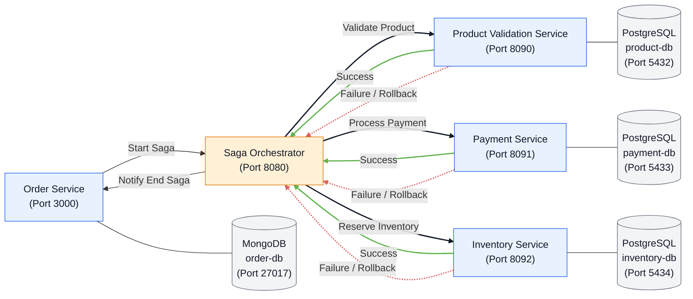

# saga

```mermaid

flowchart LR
    OS["Order Service<br/>(Port 3000)"]
    ORCH["Saga Orchestrator<br/>(Port 8080)"]
    PS["Product Validation Service<br/>(Port 8090)"]
    PAY["Payment Service<br/>(Port 8091)"]
    INV["Inventory Service<br/>(Port 8092)"]

    ODB[("MongoDB<br/>order-db<br/>(Port 27017)")]
    PDB[("PostgreSQL<br/>product-db<br/>(Port 5432)")]
    PAYDB[("PostgreSQL<br/>payment-db<br/>(Port 5433)")]
    IDB[("PostgreSQL<br/>inventory-db<br/>(Port 5434)")]

    OS -->|"Start Saga"| ORCH
    ORCH -->|"Notify End Saga"| OS

    ORCH -->|"Validate Product"| PS
    PS -->|"Success"| ORCH
    PS -.->|"Failure / Rollback"| ORCH

    ORCH -->|"Process Payment"| PAY
    PAY -->|"Success"| ORCH
    PAY -.->|"Failure / Rollback"| ORCH

    ORCH -->|"Reserve Inventory"| INV
    INV -->|"Success"| ORCH
    INV -.->|"Failure / Rollback"| ORCH

    OS --- ODB
    PS --- PDB
    PAY --- PAYDB
    INV --- IDB

    classDef service fill:#e8f2ff,stroke:#2563eb,color:#111827
    classDef orchestrator fill:#fff0d6,stroke:#d97706,color:#111827
    classDef database fill:#f3f4f6,stroke:#6b7280,color:#111827

    class OS,PS,PAY,INV service
    class ORCH orchestrator
    class ODB,PDB,PAYDB,IDB database

    linkStyle 2,5,8 stroke:#111827,stroke-width:2px
    linkStyle 3,6,9 stroke:#62b34e,stroke-width:2px
    linkStyle 4,7,10 stroke:#dc6262,stroke-width:2px

```